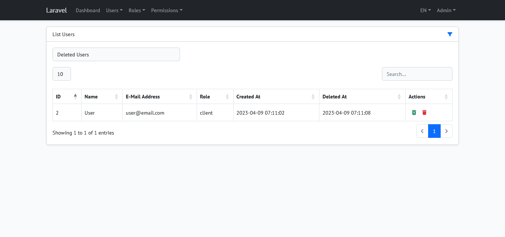

## Laravel SPA (Inertia.js, Vue 3) (Current: Laravel 8.*)

Laravel SPA (Inertia.js, Vue 3) is a multilingual admin panel basically based on the Laravel 8, Inertia.js, Vue 3, Bootstrap 5, DataTables and SweetAlert2.

## Setup

Clone the repo and follow below steps.
1. Run `composer install`
2. Copy `.env.example` to `.env`
3. Set valid database credentials of env variables `DB_DATABASE`, `DB_USERNAME`, and `DB_PASSWORD`
4. Run `php artisan key:generate` to generate application key
5. Run `php artisan migrate`
7. Run `php artisan db:seed` to seed your database
8. Run `npm i` (Recommended node version `>= V13.14.0`)
9. Run `npm run dev` or `npm run prod` as per your environment

## Demo Credentials

**User:** admin@email.com\
**Password:** qwerty

## License

The Laravel framework is open-sourced software licensed under the [MIT license](https://opensource.org/licenses/MIT).

## ScreenShots

## List Users

## List Deleted Users

## List Roles

## List Permissions

